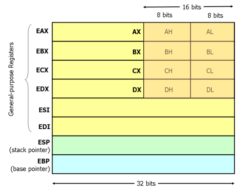

# I registri
I moderni processori x86 possiedono 8 registri da 32-bit general puprose.



[Processore](Processore.md)


# Dichiarazione variabili
La dichiarazione di variabili statiche deve essere preceduta da `.DATA` e per dichiararle vengono utilizzate le istruzioni:

- `DB` per 1 byte (Declare Byte)
- `DW` per 2 byte (Declare Word)
- `DD` per 4 byte (Declare Double word)

## Sintassi
```x86asm
.DATA
 
var  DB 64	;dichiara una variabile grande un byte all'indirizzo var
				e assegna il valore 64.
 
var2 DW ?	;dichiara una variabile grande due byte all'indirizzo var2
				ma non assegna nessun valore.
 
     DB 10	;dichiara una variabile grande un byte senza nome,
	 			all'indirizzo var2+1 e assegna il valore 10.
```

## Array
Differentemente dai linguaggi ad alto livello, gli array sono solo celle di memoria contigue.
Per dichiarare un array si possono elencare i vari valori, utilizzare l'istruzione `DUP` o delle stringhe.
L'istruzione `DUP` ripete un valore per un determinato numero di volte: `4 DUP(2)` è uguale a `2, 2, 2, 2`.

### Esempi
```x86asm
.DATA

Z		DD 1, 2, 3		;dichiara 3 variabili da 4 byte ciascuna,
							le inizializza con 1, 2 e 3 rispettivamente.
							Il valore di Z+8 sarà 3.

bytes	DB 10 DUP(?)	;dichiara 10 variabili non inizializzate partendo
							dall'indirizzo bytes.

arr		DD 100 DUP(0)	;dichiara 100 variabile inizializzate a 100 grandi
							4 byte ciascuna, partendo dall'indirizzo arr.

str		DB 'hello',0	;dichiara 6 byte contenenti ciascuno il codice
							ASCII della lettera corrispondente e uno 0.
```


# Istruzioni di movimento dati

## MOV
I processori x86 possono indirizzare fino a $2^{32}$ byte di memoria
Oltre a supportare gli indirizzamenti tramite nomi delle variabili, è possibile sommare fino a 2 registri (32-bit) con una costante (signed 32-bit).
Un registro può essere inoltre moltiplicato per 2, 4 o 8.

Per copiare variabili viene utilizzata l'istruzione `MOV`.

### Sintassi
I parametri possibili sono:

- `mov <reg>,<reg>`
- `mov <reg>,<mem>`
- `mov <mem>,<reg>`
- `mov <reg>,<const>`
- `mov <mem>,<const>`

### Esempi
```x86asm
MOV EAX, [EBX]			;copia i 4 byte in memoria all'indirizzo
							contenuto in EBX in EAX.

MOV [var], EBX			;copia i il contenuto di EBX nello spazio di
							memoria all'indirizzo var grande 4 byte.

MOV EAX, [ESI-4]		;copia i 4 byte in memoria all'indirizzo
							contenuto in ESI+(-4) in EAX.

MOV [ESI+EAX], CL		;copia il contenuto di CL all'indirizzo di
							memoria ESI+EAX.

MOV EDX, [ESI+4*EBX]	;copia i 4 byte in memoria all'indirizzo
							ESI+(4*EBX) in EDX.
```

Alcune sintassi invalide:
```x86asm
MOV EAX, [EBX-ECX]		;si possono solo sommare due registri.

MOV [EAX+ESI+EDI], EBX	;si possono sommare massimo due registri.
```

### Specificare la grandezza
Per specificare la grandezza dei valori da copiare nel caso ci siano ambiguità è necessario usare:

- `BYTE PTR`
- `WORD PTR`
- `DWORD PTR`

#### Esempi
```x86asm
MOV BYTE PTR [EBX], 2	;copia 2 in un singolo byte all'indirizzo in EBX.

MOV WORD PTR [EBX], 2	;copia la rappresentazione a 16-bit di 2 in
							2 byte partendo dall'indirizzo in EBX.

MOV DWORD PTR [EBX], 2	;copia la rappresentazione a 32-bit di 2 in
							4 byte partendo dall'indirizzo in EBX.
```

## PUSH
L'istruzione `PUSH` copia i suoi parametri in cima allo stack in memoria.

Azioni eseguite da `PUSH`:

- decrementa `ESP` di 4
- copia il suo argomento all'indirizzo `[ESP]`

`ESP` è lo stack pointer e contiene l'indirizzo di memoria dell'ultimo valore nello stack.
Lo stack pointer viene decrementato perchè lo stack cresce verso il basso: dall'indirizzo più grande a quello più piccolo.

### Sintassi
I parametri possibili sono:

- `PUSH <reg32>`
- `PUSH <mem>`
- `PUSH <con32>`

### Esempi
```x86asm
PUSH EAX	;aggiunge EAX allo stack.

PUSH [var]	;aggiunge il valore contenuto di 4 byte all'indirizzo
				var allo stack.
```


## POP
L'istruzione `POP` muove il valore in cima allo stack in memoria in una variabile o registro.

Azioni eseguite da `POP`:

- copia il valore all'indirizzo `[ESP]` nel suo argomento
- incrementa `ESP` di 4

### Sintassi
I parametri possibili sono:

- `POP <reg32>`
- `POP <mem>`

### Esempi
```x86asm
POP EDI		;rimuove l'ultimo valore dello stack e lo copia in EDI.

POP [EBX]	;rimuove l'ultimo valore dello stack e lo copia in memoria
				all'indirizzo in EBX.
```


## LEA
L'istruzione `LEA` copia l'indirizzo di una variabile in memoria in un registro.

### Sintassi
I parametri possibili sono:

- `LEA <reg32>, <mem>`

### Esempi
```x86asm
LEA EDI, [EBX+4*ESI]	;l'indirizzo della variabile all'indirizzo
							EBX+4*ESI viene copiato in EDI

LEA EAX, [var]			;l'indirizzo della variabile var viene copiato in EAX
```

### Differenze con MOV
Poniamo questa situazione:

Registri:

| Registro | Valore     |
| -------- | ---------- |
| EAX      | 0x00000000 |
| EBX      | 0x00403A40 |

Memoria:

| Indirizzo		| Valore		|
|---------------|---------------|
| 0x00403A40	| 0x7C81776F	|
| 0x00403A44	| 0x7C911000	|
| 0x00403A48	| 0x0012C140	|
| 0x00403A4C	| 0x7FFDB000	|

Programma:
```x86asm
LEA EAX, [EBX+8]	;EAX conterrà 0x00403A48

MOV EAX, [EBX+8]	;EAX conterrà 0x0012C140
```