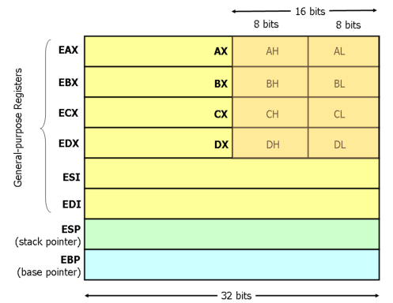

# I registri
I registri si dividono in general purpose o special purpose.

## General purpose
Sono:

- `EAX`
- `EBX`
- `ECX`
- `EDX`
- `ESI` (source index)
- `EDI` (destination index)

## Special purpose
I registri special purpose si dividono in registri di segmento e altri

### Registri di segmento
Sono:

- `ECS` (code segment)
- `EDS` (data segment)
- `ES`  (extra segment)
- `SS`  (stack segment, indirizzo del segmento e offset top dello stack)

### Altri
Sono:

- `EIP`/`PC` (instruction pointer, rappresenta la prossima istruzione)
- `ESP` (stack pointer)
- `EBP` (base pointer)
- ...