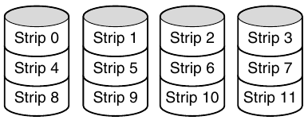
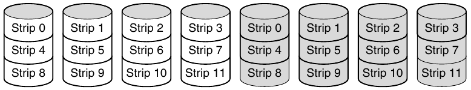
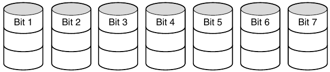
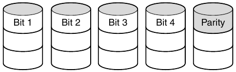
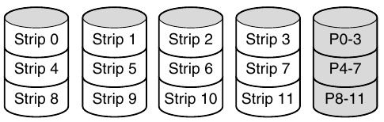
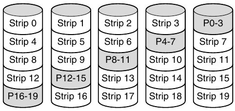

# Definizione
RAID significa (Redundant Array of Inexpensive Disks / Redundant Array of Indipendent Disks).

L'idea dietro al RAID è quella di utilizzare più dischi, facendo in modo che il sistema ne veda solo uno. Questo permette di aumentare la velocità di scrittura/lettura o di poter ripristinare tutti i dati nel caso di qualche guasto.

# Tipologie di RAID
Esistono diversi livelli di RAID, ognuno con diverse caratteristiche.

## RAID 0
Il RAID di livello 0 esegue uno _striping_ (scrittura/lettura su diversi dischi in modo continuo).
Non essendoci nessuna rindondanza, a volte non viene considerato un vero e proprio RAID.

## RAID 1
Il RAID di livello 1 esegue una duplicazione di tutti i dati su ulteriori dischi.
Essendo che la scrittura deve essere doppia, non si ha un vantaggio; mentre nella lettura il carico può essere distribuito tra le due copie.

## RAID 2
Il RAID di livello 2 lavora su word/byte, non su strisce di settori.

Vengono distribuite word di 7 bit contenenti 4 bit di dati e 3 bit per l'ECC (Hamming code) su ogni disco.

## RAID 3
Il RAID di livello 3 è una versione semplificata del RAID 2.
Le word vengono distribuite sui dischi, e por ogni word viene calcolato un ECC, scritto nell'ultimo disco.

Questo permette di recuperare i dati se un disco smette di funzionare.

## RAID 4
Il RAID di livello 4 lavora con _strip_ di settori e quindi non richiede dischi sincronizzati (a differenza del RAID 2 e 3).
Nell'ultimo disco vengono salvati gli ECC di ogni strip.

## RAID 5
Il RAID di livello 5 è identico al RAID 4 ma distribuisce gli ECC sui vari dischi.

